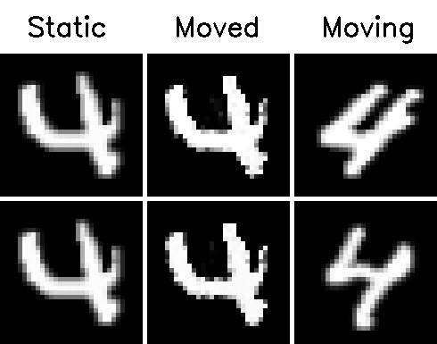

# Deep-learning-based 2D Deformable Image Registration with MNIST

I’ve been accepted into [Google Summer of Code 2020](https://summerofcode.withgoogle.com/) under the [International Neuroinformatics Coordinating Facility](https://www.incf.org/) (INCF), and I will be working with the organization [Diffusion Imaging in Python](https://www.dipy.org/) (DIPY) in developing deep-learning-based image registration methods.  
  
  
Link to the project — [MRI Registration using Deep Learning and Implementation of Thin-Plate Splines](https://summerofcode.withgoogle.com/projects/#6582514342166528)  
  
  
Before the official coding phase started, I had developed a proof of concept for deep-learning-based deformable image registration using the MNIST dataset, taking ideas from these papers:
- [An Unsupervised Learning Model for Deformable Medical Image Registration](http://openaccess.thecvf.com/content_cvpr_2018/papers/Balakrishnan_An_Unsupervised_Learning_CVPR_2018_paper.pdf)  
- [Non-rigid image registration using fully convolutional networks with deep self-supervision](https://arxiv.org/pdf/1709.00799.pdf)  
- [End-to-End Unsupervised Deformable Image Registration with a Convolutional Neural Network](https://arxiv.org/pdf/1704.06065.pdf) 
  

Link to the Colab notebook — https://colab.research.google.com/drive/1fTzz1aT2sb8oAXRO1-dr6O_IR6dof36e?usp=sharing

## What is image registration?
Image registration is the process of finding a transformation that aligns one image to another. Generally, the inputs to this process are two images: a reference image also known as a static image, and a moving image that will be aligned to the static image. The goal here is to warp and match the moving image to the static image.  

## How to warp the image?  
Given a moving image and the static image as inputs, the convolutional encoder-decoder network computes the pixel-wise deformation between the two images. This deformation field also called a registration field, gives the new sampling locations in the moving image. The transformed image is obtained by sampling the moving image at these locations. Simply put, we are just rearranging the pixels in the moving image until it matches the static image as much as possible. The framework is as shown in the figure below.

 
  

  

The sampling points do not necessarily map to an integer location in the moving image. So some kind of interpolation technique is required when the points are fractional. Also, for the whole framework to be end-to-end trainable, the sampling block needs to be differentiable as well. The differentiable image sampling process is very well explained in these resources:

- Jaderberg, Max, Karen Simonyan, and Andrew Zisserman. “Spatial transformer networks.” Advances in neural information processing systems. 2015.
- [TensorFlow implementation of spatial transformer networks.](https://github.com/tensorflow/models/tree/master/research/transformer)
- [Blog post on spatial transformer networks by Kushagra Bhatnagar](https://link.medium.com/0b2OrmqVO5)
- [Blog posts on spatial transformer networks by Kevin Zakka](https://kevinzakka.github.io/2017/01/18/stn-part2/)  

As described in [1], I used bilinear interpolation which is differentiable and can be written in pure TensorFlow functions. In bilinear interpolation, the value at the fractional location is the weighted sum of the values at the four nearest integer locations.
The network is trained by optimizing a similarity metric between the transformed and the static images. Once the training is finished, the network can predict the optimal registration field in one go, unlike the traditional algorithms, which involve numerical optimization for every new pair, thereby taking longer durations.

## Training the network
The MNIST dataset was filtered to keep just one class of images and the static image was randomly chosen from the test set of the filtered dataset. The network was trained using a similarity metric, which is a measure of how similar/dissimilar two images are. Some examples include the mean squared error (MSE) and the normalized cross-correlation (NCC). The cross-correlation loss was used as it is robust to intensity variations. It is simply the dot product of two normalized images. The training takes about 5 minutes on a Tesla K80 GPU and about 10 minutes on CPU (i5–8250U).

## Sample outputs

  |  | 
--- | --- | ---
 |  | 

## Highlights up till week 1
- Developed a POC for non-rigid image registration using the MNIST dataset. [Colab notebook](https://colab.research.google.com/drive/1fTzz1aT2sb8oAXRO1-dr6O_IR6dof36e?usp=sharing)
- Made a pull request for the same. [#2137](https://github.com/dipy/dipy/pull/2137)
- The code that I first implemented was written in TF 2 with custom training and testing loops. So I refashioned the code to follow the API in nn.model.py, with some minor additions and changes.
- Added comments and docstrings.

## References
1. Jaderberg, Max, Karen Simonyan, and Andrew Zisserman. “Spatial transformer networks.” Advances in neural information processing systems. 2015.
Balakrishnan, Guha, et al. “An unsupervised learning model for deformable medical image registration.” Proceedings of the IEEE conference on computer vision and pattern recognition. 2018.  
2. Li, Hongming, and Yong Fan. “Non-rigid image registration using fully convolutional networks with deep self-supervision.” arXiv preprint arXiv:1709.00799 (2017).  
3.  de Vos, Bob D., et al. “End-to-end unsupervised deformable image registration with a convolutional neural network.” Deep Learning in Medical Image Analysis and Multimodal Learning for Clinical Decision Support. Springer, Cham, 2017. 204–212.  
4. [TensorFlow implementation of spatial transformer networks](https://github.com/tensorflow/models/tree/master/research/transformer)  
5. [Blog post on spatial transformer networks by Kushagra Bhatnagar](https://link.medium.com/0b2OrmqVO5)  
6. [Blog posts on spatial transformer networks by Kevin Zakka](https://kevinzakka.github.io/2017/01/18/stn-part2/)
