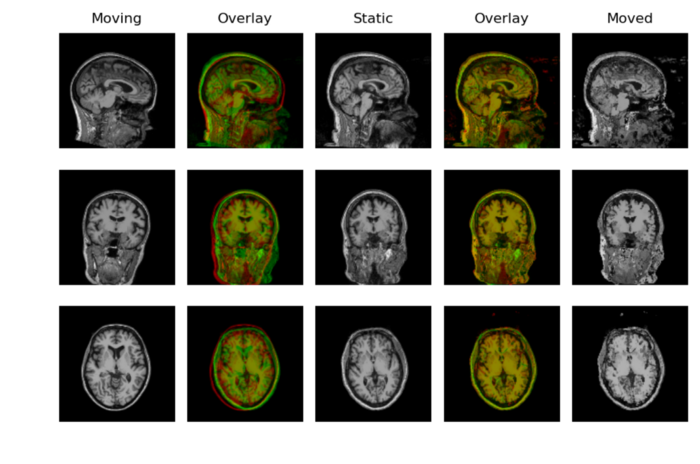
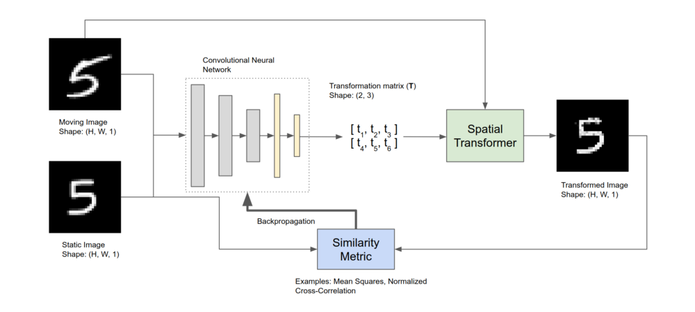
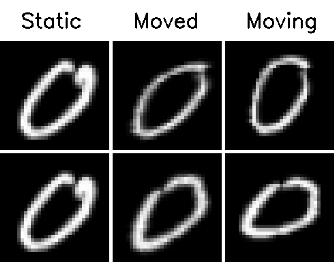
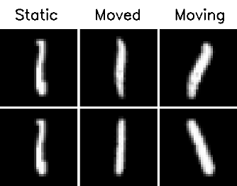
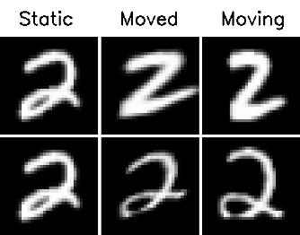
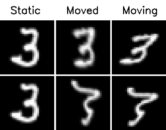
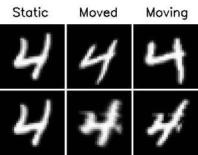
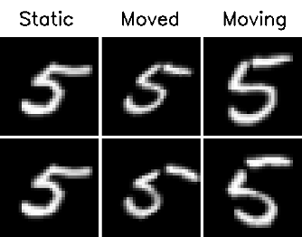
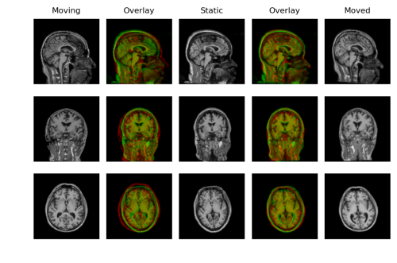
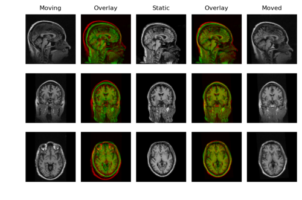

# Deep-learning-based 2D and 3D Affine Registration

Last week I had developed a basic framework for 2D deformable image registration based on deep learning and showed how to register images of handwritten digits from the MNIST dataset. Apart from the minor differences in the loss functions and the architecture, the framework is essentially the same as the [VoxelMorph](https://openaccess.thecvf.com/content_cvpr_2018/papers/Balakrishnan_An_Unsupervised_Learning_CVPR_2018_paper.pdf) framework.  

This week my task was to extend the implementation to 3D and try it out on a small dataset of 150 T1-weighted scans. With some trivial changes to the existing code, I was able to implement the original VoxelMorph model. I used one scan as the static image and the rest as the moving images (125 for training and 25 for testing).  

## Sample outputs

 
  

 

The reason for poor registration is that the volumes were not skull-stripped. It was pointed out to me in the meeting that brain-extraction, which removes non-brain tissues like the skull and the eyes, is an important preprocessing step for registration.

## Deep-learning-based Affine Registration

I wanted to see if simple transformations like rigid and affine work well. So I quickly modified the code to do unsupervised 2D affine registration. The idea is an easy corollary of the Spatial Transformer Networks [1].  

2D affine registration Colab notebook — https://colab.research.google.com/drive/1dRp2Ny2tH-NXddkT4pEzN6mtjEhnFCCw?usp=sharing

#### Method
The convolutional neural network takes a moving image and the static image as input and computes the affine transformation parameters required to warp the moving image, to align to the static image. In the case of 2D registration, these parameters are six in number that control rotation, scaling, translation, and shearing.

 
  

 

The spatial transformer block takes the affine parameters and the moving image and performs two tasks:
- Computing the sampling grid
- Resampling the moving image using the sampling grid  

The new sampling grid, which is the set of points where the moving image should be sampled, is obtained by applying the affine transformation on the regular grid. Each location in the output is mapped to a location in the input using the following equation:

 
  

 

Since the new sampling locations can be non-integral, bilinear interpolation is used for sampling which is differentiable and allows the gradients to flow back to the convolutional neural network, making the whole framework end-to-end differentiable. The process of differentiable image sampling is very well explained in these resources:

- Jaderberg, Max, Karen Simonyan, and Andrew Zisserman. “Spatial transformer networks.” Advances in neural information processing systems. 2015.
- [TensorFlow implementation of spatial transformer networks.](https://github.com/tensorflow/models/tree/master/research/transformer)
- [Blog post on spatial transformer networks by Kushagra Bhatnagar](https://link.medium.com/0b2OrmqVO5)
- [Blog posts on spatial transformer networks by Kevin Zakka](https://kevinzakka.github.io/2017/01/18/stn-part2/)

#### Training
The MNIST dataset was filtered to keep just one class of images and the static image was randomly chosen from the test set of the filtered dataset. The network was trained using the normalized cross-correlation (NCC). The training takes about 5 minutes on a Tesla K80 GPU and about 10 minutes on CPU (i5–8250U).

#### 2D results
  |  | 
--- | --- | ---
 |  | 
 
 
#### Extension to 3D
I modified the 2D registration code to work with 3D volumes and tried it on the T1-weighted scans. The work of AIRNet [3], which is similar to this, is an interesting read. But unlike AIRnet which is trained in a supervised fashion and requires ground-truth affine transformation parameters, this is trained in an unsupervised fashion like how VoxelMorph does it.

#### 3D results
  | 
--- | ---
 

## Highlights of Week 2
- Implemented the [VoxelMorph](http://openaccess.thecvf.com/content_cvpr_2018/papers/Balakrishnan_An_Unsupervised_Learning_CVPR_2018_paper.pdf) model (CVPR’18).
- Implemented and trained 2D and 3D deep learning models for unsupervised affine registration. Similar to [AIRNet](https://arxiv.org/pdf/1810.02583.pdf) but trained in an unsupervised fashion like the VoxelMorph model.

## References
1. Jaderberg, Max, Karen Simonyan, and Andrew Zisserman. “Spatial transformer networks.” Advances in neural information processing systems. 2015.
Balakrishnan, Guha, et al. “An unsupervised learning model for deformable medical image registration.” Proceedings of the IEEE conference on computer vision and pattern recognition. 2018.  
2. Li, Hongming, and Yong Fan. “Non-rigid image registration using fully convolutional networks with deep self-supervision.” arXiv preprint arXiv:1709.00799 (2017).  
3.  de Vos, Bob D., et al. “End-to-end unsupervised deformable image registration with a convolutional neural network.” Deep Learning in Medical Image Analysis and Multimodal Learning for Clinical Decision Support. Springer, Cham, 2017. 204–212.  
4. [TensorFlow implementation of spatial transformer networks](https://github.com/tensorflow/models/tree/master/research/transformer)  
5. [Blog post on spatial transformer networks by Kushagra Bhatnagar](https://link.medium.com/0b2OrmqVO5)  
6. [Blog posts on spatial transformer networks by Kevin Zakka](https://kevinzakka.github.io/2017/01/18/stn-part2/)
7. Chee, Evelyn, and Zhenzhou Wu. “Airnet: Self-supervised affine registration for 3d medical images using neural networks.” arXiv preprint arXiv:1810.02583 (2018).
