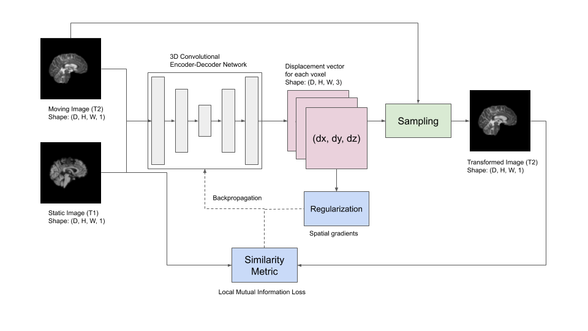

# Deep-learning-based 3D Cross-modality Registration
I spent most part of Week 5 and 6 implementing cross-modality registration using the VoxelMorph model. The architecture and the hyperparameters are the same as those described in the last week's post. The only difference is the loss function - mutual information loss [1] was used instead of the cross-correlation loss [2]. The framework is as shown in the figure below. The static image is a T1-weighted image and the moving images are T2-weighted images. The goal is to deform the T2 image to align with the T1 image.

 
  

 

The results are not good. One plausible reason could be the small size of the dataset. I also need to experiment with the regularization parameters.

  | 
--- | ---

Link to Colab notebook -  https://colab.research.google.com/drive/1F5uc2chcxVp8-XC4XI360Z_VMOsA7JrE?usp=sharing

## References
1. Guo, C.K., 2019. Multi-modal image registration with unsupervised deep learning (Doctoral dissertation, Massachusetts Institute of Technology).
2. Balakrishnan, Guha, et al. "An unsupervised learning model for deformable medical image registration." Proceedings of the IEEE conference on computer vision and pattern recognition. 2018.
