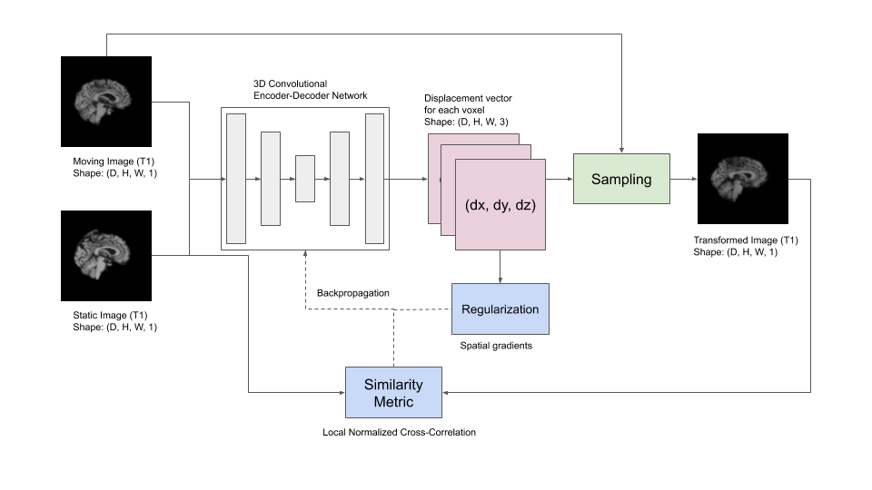
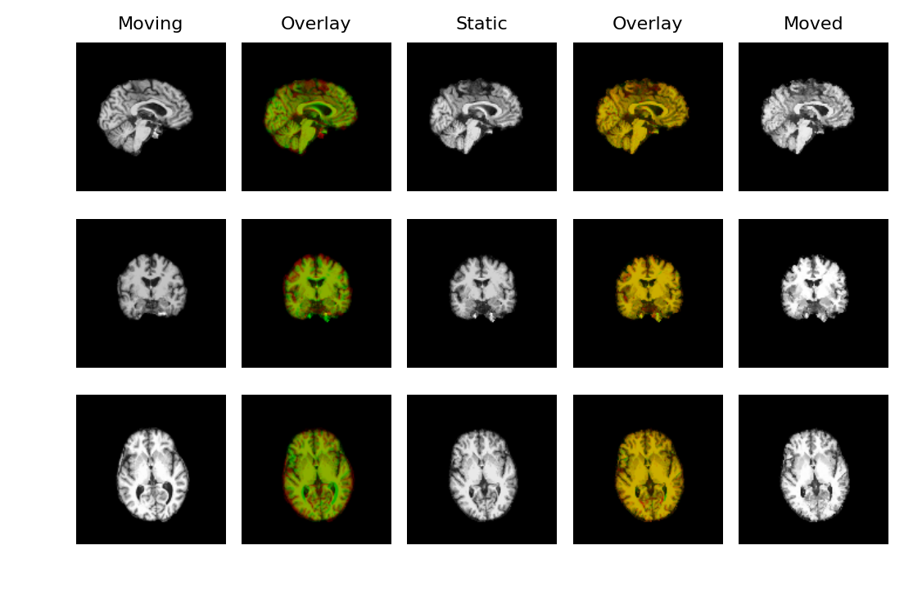
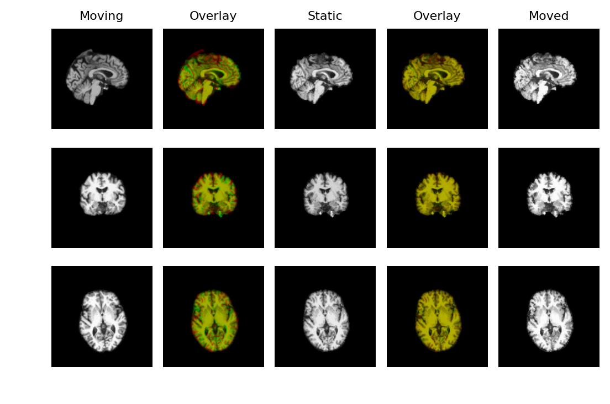

# Deep-learning-based 3D Deformable Registration of T1-weighted images

Last week I finished with the implementation of the VoxelMorph framework and trained it on the raw sample data (150 T1-weighted images). The data was not skull stripped and affine registered as indicated in the paper. Naturally, the results were bad.

 
  

  

This week I performed the necessary preprocessing: removed the skulls in the volumes using the brain segmentation that was provided, and affine registered the volumes to the static image, using the DIPY tutorial: [Affine Registration in 3D. The architecture](https://www.dipy.org/documentation/1.1.1./examples_built/affine_registration_3d/#example-affine-registration-3d), the loss functions, and the hyperparameters are the same as those described in the paper. 
Link to Colab notebook - https://colab.research.google.com/drive/1-lPuD4vRCeihKYMQKDDXLYq1dxm-3tJR?usp=sharing

#### Results
  | 
--- | ---

After training the model with several settings, what I observed is that the model only works for small deformations, so affine registration is very important. Also, I guess the results can be further improved by training on a larger dataset.

## References
1. Balakrishnan, G., Zhao, A., Sabuncu, M.R., Guttag, J. and Dalca, A.V., 2018. An unsupervised learning model for deformable medical image registration. In Proceedings of the IEEE conference on computer vision and pattern recognition (pp. 9252–9260).
2. Jaderberg, M., Simonyan, K. and Zisserman, A., 2015. Spatial transformer networks. In Advances in neural information processing systems (pp. 2017–2025).
3. TensorFlow implementation of spatial transformer networks. https://github.com/tensorflow/models/tree/master/research/transformer
4. Spatial Transformer Networks by Kushagra Bhatnagar. https://link.medium.com/0b2OrmqVO5
