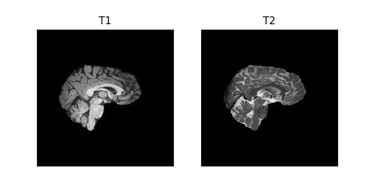
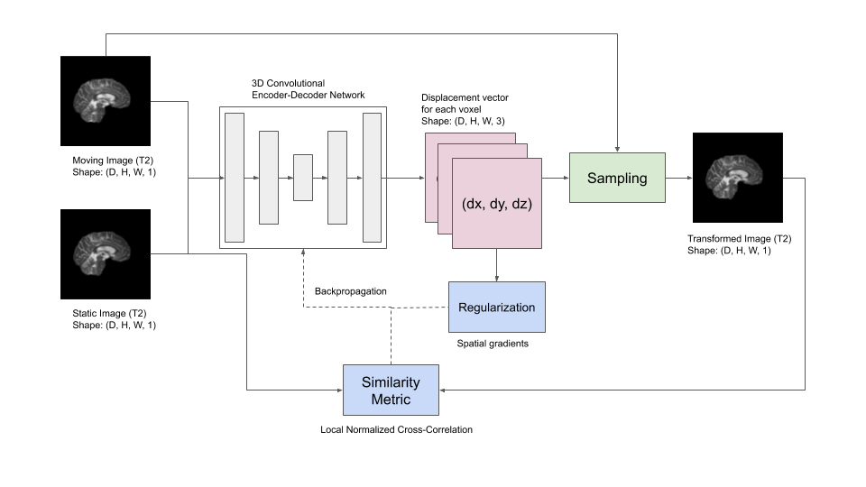
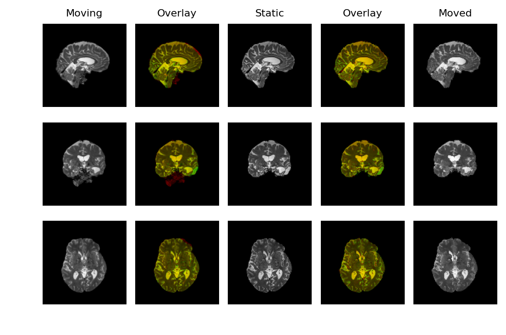
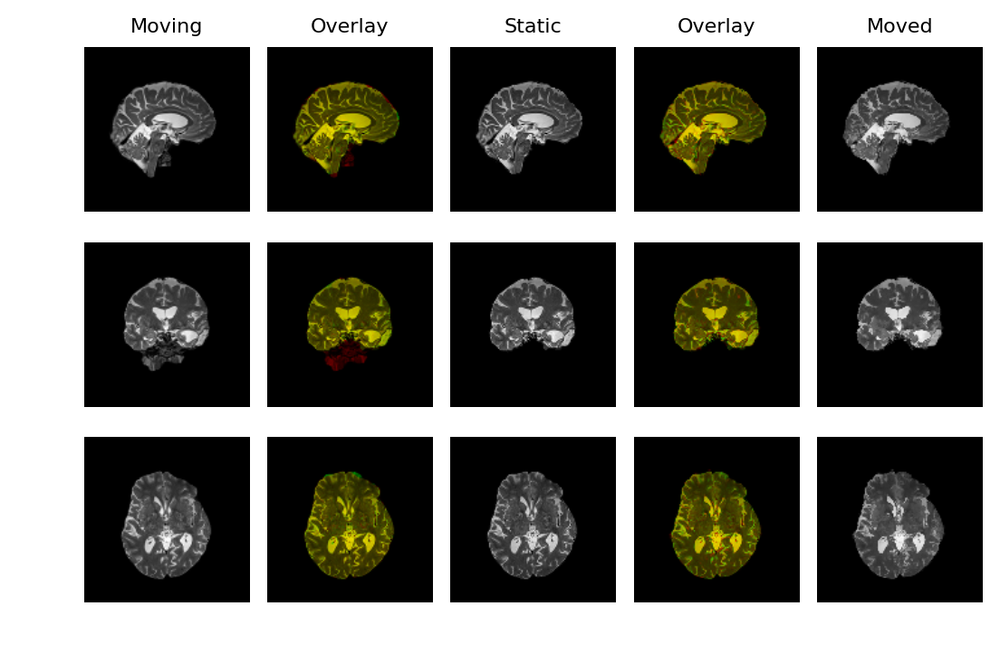

# Deep-learning-based 3D Deformable Registration of T2-weighted Images
Last week I've implemented the VoxelMorph model and got it working on a small set of T1-weighted images. So this week my task was to check if it works on other modalities as well (T2-weighted).  

#### T1 vs. T2
T1 images are brighter (white) in high-fat content regions and dark in regions with water content. Whereas the T2 images are bright at regions filled with water (cerebrospinal fluid, tumors) and dark at fatty regions (white matter). The T2 images are usually used to locate tumors.

 
  

 

#### Framework
The architecture and the loss functions are the same as those described in the paper. Only the learning rate and epochs were changed. I've played around with the learning rate and epochs a little bit and found 60 epochs and 0.001 learning rate to work well.

 
  

 

#### Results
  | 
--- | ---

The results are reasonably good. I guess with more data the registration could be further improved.

## References
1. Jaderberg, Max, Karen Simonyan, and Andrew Zisserman. "Spatial transformer networks." Advances in neural information processing systems. 2015.
2. Balakrishnan, Guha, et al. "An unsupervised learning model for deformable medical image registration." Proceedings of the IEEE conference on computer vision and pattern recognition. 2018.

